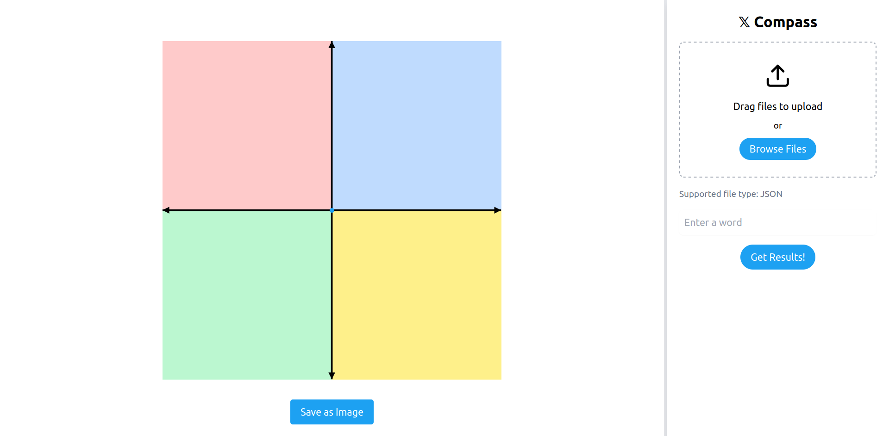

# 𝕏Compass
This is a fun project meant to test out the rating capabilities of LLMs.

----

Requirements:
- ADD REQ

TODOS:
- [] Make getting coords faster with proper batching.
- [] Add functionality for custom coordinate words.
- [] Add getting tweets by date.
- [] Experiment with better prompts.
- [] Add an option to change local LLM from the UI.
- [] Make login less annoying if creds are already entered, add a loading sign.
- [] Add a progress bar for the chart instead of loading sign.
- [] Debloat everything.